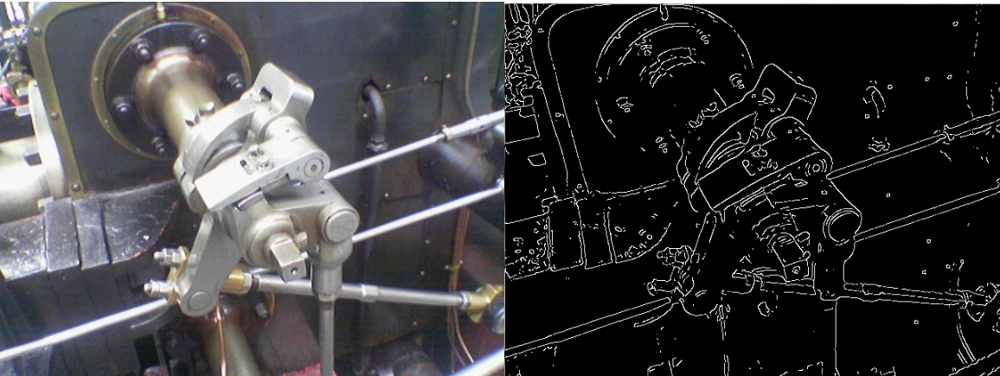

# Canny Edge Detector in Cuda

Implemented by **Mariia Berdnyk**



## Description of the algorithm
The algorithm works on RGB images in multiple steps. Each step can be implemented separately, although they are all linked in the end:

1. Converts the original image to a grayscale version (bw_kernel)
2. Applies a Gaussian blur (gaussian_kernel)
3. Computes the Sobel magnitude and angle of each pixel (sobel_kernel)
4. Finds potential edges  based on thresholds   (threshold_kernel)
5. Suppresses edges which are too weak (hysterisis_kernel)

A detailed implementation of the kernels can be found in the paper [Canny Edge Detection on GPU using CUDA](https://ieeexplore.ieee.org/document/4563088).

## Project

`project-gpu.py` is the main file. It takes as an input an image to process and writes the resulting image on disk. 
It supports the following usage:
```sh
     python project-gpu.py [--tb int] [--bw] [--gauss] [--sobel] [--threshold]  <inputImage> <outputImage>
```
where

- `inputImage` :  the source image
- `outputImage` : the destination image  
- `--tb int` : optional size of a thread block for all operations
- `--bw` : perform only the bw_kernel
- `--gauss` : perform the bw_kernel and the gauss_kernel 
- `--sobel` : perform all kernels up to sobel_kernel  and write to disk the magnitude of each pixel
- `--threshold` : perform all kernels up to threshold_kernel

If there is no optional argument about kernels, the program performs all kernels and produces the final image. 